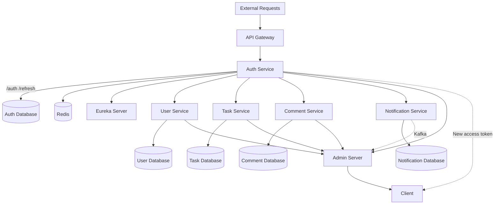

# 🚀 WorkStream – Event-Driven Microservices Platform for Task Orchestration

> **Production-grade microservices backend** system built with Java 21, Spring Boot 3, Kafka, Redis, Docker, and
> PostgreSQL.
> WorkStream orchestrates a **collaborative task lifecycle** between Managers and Workers with **asynchronous
notifications**, **role-based access**, and a **resilient modular design** suited for cloud-native deployments.

---

## 📌 Table of Contents

* [🗒️ Microservices Overview](#%EF%B8%8F-microservices-overview)
* [🛠️ Technologies Used](#%EF%B8%8F-technologies-used)
* [📡 Inter-Service Communication](#-inter-service-communication)
* [📤 Kafka-Based Notifications](#-kafka-based-notifications)
* [📔️ Database Strategy](#%EF%B8%8F-database-strategy)
* [🌐 Distributed Systems Challenges Tackled](#-distributed-systems-challenges-tackled)
* [🔐 Security](#-security)
* [♻️ Refresh Token Flow](#%EF%B8%8F-refresh-token-flow)
* [🔑 OAuth2 + JWKS Integration](#-oauth2--jwks-integration)
* [📆 Architecture Diagram](#-architecture-diagram)
* [⚙️ DevOps & Deployment](#%EF%B8%8F-devops--deployment)
* [📂 Folder Structure](#-folder-structure-sample-task-service)
* [📄 Sample Endpoints](#-sample-endpoints)
* [🙋‍♂️ Author](#%EF%B8%8F-author)
* [🚀 Roadmap](#-roadmap)
* [🎩 Contributing](#-contributing)

> ⚡ Note: Due to multiple microservices and infra components (Kafka, Redis, Postgres), WorkStream is not hosted live.
> You can run the full platform locally with a single command using Docker Compose.

## 🗒️ Microservices Overview

| Service                     | Role & Responsibility                                          | Port   |
|-----------------------------|----------------------------------------------------------------|--------|
| 🔐 **Auth Service**         | User login, registration, JWT issuing, refresh token via Redis | `8085` |
| 👤 **User Service**         | User profile, role management (ADMIN / MANAGER / WORKER)       | `8081` |
| 📋 **Task Service**         | Task assignment, submission, and extension lifecycle           | `8082` |
| 💬 **Comment Service**      | Add and retrieve threaded task comments                        | `8084` |
| 🔔 **Notification Service** | Kafka consumer for task event notifications to workers         | `8083` |
| 🛡️ **API Gateway**         | Secures & routes APIs, JWT validation, service whitelisting    | `8080` |
| 🔎 **Eureka Server**        | Central service registry and discovery hub                     | `8761` |
| 📊 **Admin Server**         | Spring Boot Admin – service health, logs, metrics              | `9090` |

---

## 🛠️ Technologies Used

| Category            | Tools / Frameworks                         |
|---------------------|--------------------------------------------|
| 🔧 Language & Core  | Java 21, Spring Boot 3, Spring Cloud       |
| 🔐 Auth & Security  | JWT, Spring Security, Redis (refresh flow) |
| 🔀 Communication    | Spring WebSockets, Feign Clients, Eureka      |
| 📨 Messaging        | Apache Kafka (asynchronous delivery)       |
| 📔️ Database        | PostgreSQL (per-service isolation)         |
| ⚙️ Caching          | Redis (token & entity cache)               |
| 📆 Containerization | Docker, Docker Compose                     |
| 📊 Monitoring       | Spring Boot Admin, Actuator                |

---

## 📡 Inter-Service Communication

| Type            | Usage Examples                                        |
|-----------------|-------------------------------------------------------|
| 🔀 REST (Feign) | Sync calls like Task → User or Comment → User         |
| 📤 Kafka        | TaskService → NotificationService (async events)      |
| 🛡️ JWT         | Auth-protected APIs across Gateway                    |
| 📘 Eureka       | Auto-registration and load-balanced service discovery |

---

## 📤 Kafka-Based Notifications

> All task-related actions like `assign`, `extend`, `submit` are published asynchronously to Kafka.

* **Topic:** `notifications`
* **Producer:** `task-service`
* **Consumer:** `notification-service`
* **Partitioning key:** `recipientId` (worker ID)

```java
public class NotificationProducer {
    private final KafkaTemplate<String, String> kafkaTemplate;
    private final ObjectMapper objectMapper;

    public void sendNotification(Notifications notification) {
        Thread.startVirtualThread(() -> sendSync(notification));
    }

    private void sendSync(Notifications notification) {
        try {
            String message = objectMapper.writeValueAsString(notification);
            kafkaTemplate.send("notifications", notification.recipientId().toString(), message);
            log.info("📤 Published notification to Kafka for user: {}", notification.recipientId());
        } catch (Exception e) {
            log.error("❌ Failed to publish Kafka message", e);
        }
    }
}
```

**Benefits:**

* Non-blocking delivery
* Event decoupling
* Fault-tolerant notification delivery
* Horizontal scaling supported by Kafka partitions
* Worker-specific targeting

---

## 📔️ Database Strategy

Each microservice owns its **isolated PostgreSQL schema**, ensuring modularity and fail-safe migrations.

| Service              | DB Name   | Volume Name           | Isolation |
|----------------------|-----------|-----------------------|-----------|
| Auth Service         | `auth`    | `pgdata-auth`         | ✅ Yes     |
| User Service         | `user`    | `pgdata-user`         | ✅ Yes     |
| Task Service         | `task`    | `pgdata-task`         | ✅ Yes     |
| Comment Service      | `comment` | `pgdata-comment`      | ✅ Yes     |
| Notification Service | `notif`   | `pgdata-notification` | ✅ Yes     |

**Benefits:**

* Enables CI/CD with DB versioning per service
* Prevents cross-service coupling via DB joins
* Each DB has its own lifecycle and scaling

---

## 🌐 Distributed Systems Challenges Tackled

- ✅ **Service Discovery** with Eureka
- ✅ **Fault Tolerance** with Resilience4j & retries
- ✅ **Event-driven Asynchronicity** with Kafka
- ✅ **Data Consistency** via per-service DBs (avoiding cross joins)
- ✅ **Stateless Auth** with JWT + Redis refresh

---

## 🔐 Security

* JWT-based access token (short-lived) + Redis-backed refresh token (long-lived)
* Role-based access control using Spring Security DSL
* API Gateway handles auth, CORS, CSRF, and whitelisted public endpoints
* Redis ensures stateless auth and allows token revocation

---

## ♻️ Refresh Token Flow

```java
@PostMapping("/refresh")
public ResponseEntity<Response> refresh(HttpServletRequest request) {
    Response response = authService.refresh(request);
    return ResponseEntity.status(response.status()).body(response);
}
```

```java
public Response refresh(HttpServletRequest request) {
    Cookie[] cookies = request.getCookies();
    if (cookies == null) throw new RuntimeException("Refresh token missing");
    String refreshToken = Arrays.stream(cookies)
            .filter(cookie -> jwtCookieProperties.getName().equals(cookie.getName()))
            .map(Cookie::getValue)
            .filter(jwtService::isValid)
            .findFirst()
            .orElseThrow(() -> new RuntimeException("Refresh token missing"));

    String email = jwtService.extractSubject(refreshToken)
            .orElseThrow(() -> new RuntimeException("Invalid refresh token"));

    return userRepo.findByEmail(email)
            .map(user -> new Response("Access token refreshed", HttpStatus.OK,
                    Map.of("accessToken", jwtService.generateToken(user.getEmail(), user.getId(), user.getRole()),
                            "role", user.getRole())))
            .orElseThrow(() -> new RuntimeException("User not found"));
}
```

---

## 🔑 OAuth2 + JWKS Integration

Enable JWT validation across microservices using a **public-private key pair** and expose a **JWKS endpoint** for secure key distribution.

### 📌 Objective

* Auth Service issues **signed JWTs** using **private key**
* API Gateway and all other services **validate JWTs** via **public key**
* JWKS endpoint makes public key **discoverable**

### 🗝️ Step 1: Generate RSA Key Pair

```bash
# Generate private key
openssl genrsa -out private.pem 2048

# Extract public key
openssl rsa -in private.pem -pubout -out public.pem
```

Place both files in `src/main/resources/keys/` inside the **Auth Service**.

### 🧱 Step 2: Load Keys in Auth Service

**Dependencies (pom.xml)**:

```xml
<dependency>
  <groupId>com.nimbusds</groupId>
  <artifactId>nimbus-jose-jwt</artifactId>
  <version>9.37.3</version>
</dependency>
```

**RsaKeyConfig.java**:

```java
@Configuration
public class RsaKeyConfig {
    @Value("classpath:keys/private.pem")
    private Resource privateKey;

    @Value("classpath:keys/public.pem")
    private Resource publicKey;

    @Bean
    public RSAPrivateKey rsaPrivateKey() throws Exception {
        String key = new String(privateKey.getInputStream().readAllBytes())
            .replaceAll("-----\\w+ PRIVATE KEY-----", "")
            .replaceAll("\\s", "");
        byte[] decoded = Base64.getDecoder().decode(key);
        PKCS8EncodedKeySpec keySpec = new PKCS8EncodedKeySpec(decoded);
        return (RSAPrivateKey) KeyFactory.getInstance("RSA").generatePrivate(keySpec);
    }

    @Bean
    public RSAPublicKey rsaPublicKey() throws Exception {
        String key = new String(publicKey.getInputStream().readAllBytes())
            .replaceAll("-----\\w+ PUBLIC KEY-----", "")
            .replaceAll("\\s", "");
        byte[] decoded = Base64.getDecoder().decode(key);
        X509EncodedKeySpec keySpec = new X509EncodedKeySpec(decoded);
        return (RSAPublicKey) KeyFactory.getInstance("RSA").generatePublic(keySpec);
    }
}
```

### 🔐 Step 3: JWT Issuer Configuration

```java
@Bean
public JwtEncoder jwtEncoder(RSAPublicKey publicKey, RSAPrivateKey privateKey) {
    JWK jwk = new RSAKey.Builder(publicKey).privateKey(privateKey).keyID("WorkStream-key").build();
    JWKSource<SecurityContext> jwks = new ImmutableJWKSet<>(new JWKSet(jwk));
    return new NimbusJwtEncoder(jwks);
}
```

### 🌐 Step 4: Expose JWKS Endpoint

```java
@RestController
@RequestMapping("/.well-known")
public class JwksController {
    private final RSAPublicKey publicKey;

    public JwksController(RSAPublicKey publicKey) {
        this.publicKey = publicKey;
    }

    @GetMapping("/jwks.json")
    public Map<String, Object> getJwks() {
        RSAKey jwk = new RSAKey.Builder(publicKey).keyID("WorkStream-key").build();
        return new JWKSet(jwk).toJSONObject();
    }
}
```

### 🛡️ Step 5: Resource Server Setup (Other Services)

**Dependencies (pom.xml)**:

```xml
<dependency>
  <groupId>org.springframework.boot</groupId>
  <artifactId>spring-boot-starter-oauth2-resource-server</artifactId>
</dependency>
```

**application.yml**:

```yaml
spring:
  security:
    oauth2:
      resource-server:
        jwt:
          jwk-set-uri: http://auth-service:8085/.well-known/jwks.json
```

That’s it! All services will now verify tokens using the public key fetched from JWKS.

---

## 🏗️ Architecture Diagram



---

## ⚙️ DevOps & Deployment

```bash
# Start everything
$ docker compose up --build
```

* Kafka + Zookeeper autostart
* Docker Compose orchestrates DBs, Redis, Admin UI, Eureka
* Spring Boot Admin dashboard to view logs, metrics, and health
* Future enhancement: Prometheus + Grafana monitoring

---

## 📂 Folder Structure (Sample: task-service)

```
task-service/
├── client/             # Feign clients to other services
├── controller/         # REST endpoints
├── dto/                # Request/response models
├── exception/          # Custom Exceptions and handlers
├── kafka/              # Kafka producers
├── model/              # JPA/Entity classes
├── repository/         # Spring Data interfaces
├── service/            # Business logic
├── config/             # Web config, Kafka config, beans
└── TaskServiceApp.java # Entry point
```

---

## 📄 Sample Endpoints

| Endpoint                                   | Method | Role      | Description                  |
|--------------------------------------------|--------|-----------|------------------------------|
| `/auth/login`                              | POST   | ❌ Public  | Authenticate and issue token |
| `/auth/refresh`                            | POST   | ❌ Public  | Refresh access token (Redis) |
| `/api/tasks/manager/assign`                | POST   | ✅ MANAGER | Assign task to worker        |
| `/api/tasks/worker/submit/{id}`            | PUT    | ✅ WORKER  | Submit completed task        |
| `/api/tasks/worker/{id}/request-extension` | POST   | ✅ WORKER  | Request extension            |
| `/api/comments/{taskId}`                   | GET    | ✅ USER    | View task comments           |
| `/api/notifications/me`                    | GET    | ✅ USER    | Personal notifications       |

---

## 🙋‍♂️ Author

Built with ❤️ by [**Dhruv Gupta**](https://www.linkedin.com/in/dhruvgupta130/)

* 🛠️ Java & Spring Boot Backend Engineer
* 🔀 Kafka, DDD, Modular Design advocate
* 🌐 GitHub: [@dhruvgupta130](https://github.com/dhruvgupta130)

---

## 🚀 Roadmap
* [x] Dockerized service communication
* [x] Kafka-based event architecture
* [x] JWT + Redis refresh flow
* [ ] WebSocket-based real-time alerts
* [ ] OpenAPI documentation per service
* [ ] Integration testing via Testcontainers
* [ ] Prometheus + Grafana monitoring
* [ ] GitHub Actions CI/CD pipeline
* [ ] Kubernetes Deployment (future scope)
* [ ] gRPC for inter-service comms (stretch goal)

---

## 🎩 Contributing

Contributions are welcome! Suggestions, issues, and pull requests are encouraged.

```bash
# Fork & clone the repo
$ git clone https://github.com/dhruv-xyz/WorkStream.git

# Start local dev
$ docker compose up --build
```

---

> ✨ If you find this helpful, please star the project on GitHub!


# 🚀 WorkStream – Event-Driven Task Management Microservices

> **Production-grade microservices backend** system built with Java 21, Spring Boot 3, Kafka, Redis, Docker, and
> PostgreSQL.
> WorkStream orchestrates a **collaborative task lifecycle** between Managers and Workers with **asynchronous
> notifications**, **role-based access**, and a **resilient modular design** suited for cloud-native deployments.

## 🤝 Contribution Guidelines

We welcome contributions! 🎉

- 🐛 **Bug Reports** → Open a GitHub Issue
- 💡 **Feature Requests** → Use the Discussions tab
- 🛠️ **Code Contributions** → Fork & create a PR

If you'd like to contribute, please follow these steps:

1. **Fork the Repository**: Click the "Fork" button at the top right of the repository page.
2. **Create a Feature Branch**: Use the command:
   ```bash
   git checkout -b feature/your-feature-name
   ```

3. **Commit Your Changes**: Make your changes and commit them with clear messages.
   ```bash
   git commit -m "Add some feature"
   ```

4. **Push to the Branch**: Push your changes to your forked repository.
    ```bash
   git push origin feature/your-feature-name
    ```

5. **Open a Pull Request**: Go to the original repository and click "New Pull Request".

Your contributions will help enhance functionality, add new features, improve code quality, and fix bugs. Thank you for
considering contributing!

⭐ If you like this project, don’t forget to **star** the repo!

## 📄 License

This project is licensed under the [MIT License](LICENSE.txt) .

## 💬 Contact

For questions or suggestions, feel free to reach out:

- **Email:** dhruvgupta130@gmail.com
- **LinkedIn:** [Dhruv Gupta](https://www.linkedin.com/in/dhruvgupta130)

---

🚀 Built with passion by Dhruv Gupta
